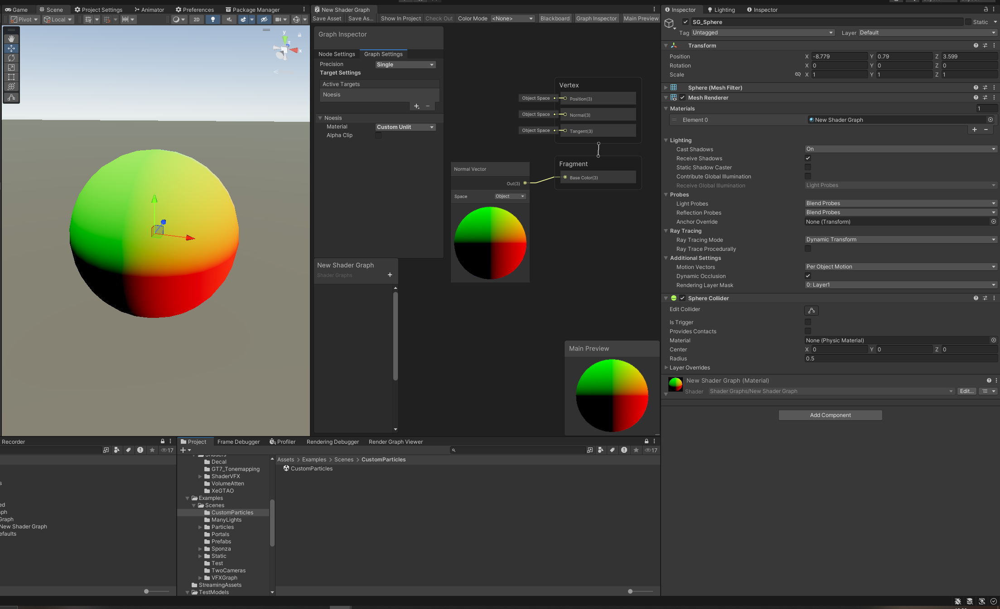
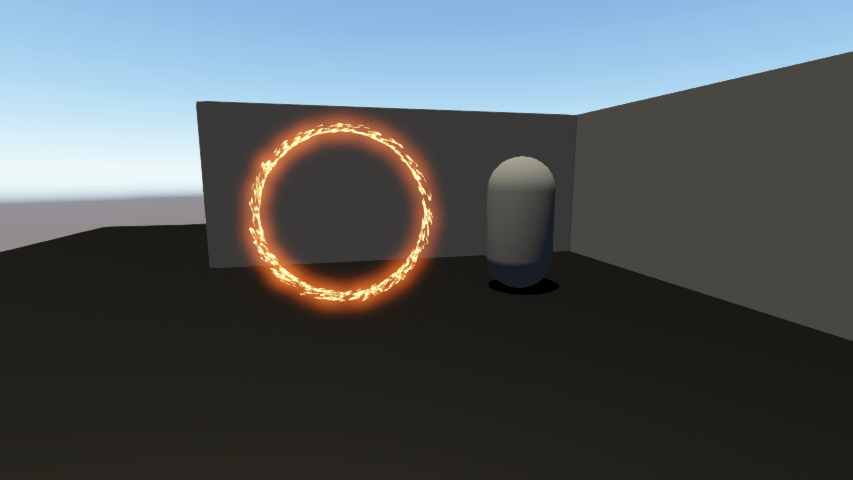
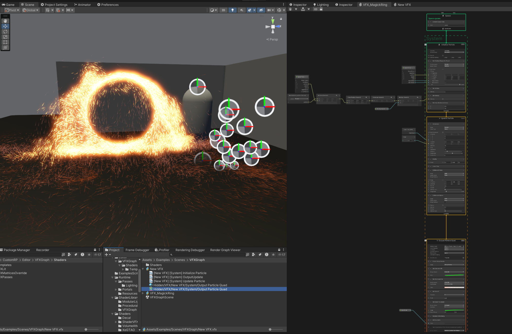

# Changelog

# Update 14.04.2026

## Shader Graph support

Essential Shader Graph support via custom  UnityEditor.ShaderGraph.Target and SubTarget  . The C# side lives inside fake URP Editor assembly for access to sealed ShaderGraph internals.

# Update 14.07.2025

## VFX Graph support!

It was challenging, a lot of not documented code, no official custom srp support, but at the end I succeeded. Currently properly work only quads. I cannot give you a guarantee that all nodes work, but they seem to. I definitely extend support for other nodes & particles types. 

# Update 02.07.2025

## New Particle System

This system provides an efficient alternative to traditional Particle Systems by leveraging GPU capabilities for all calculations and rendering. It can work fully independently in loop, or rely on script for additional features. Check https://github.com/5a5ha111/CustomVFX for more info. Still a lot of settings from standard system is not implemented, im planning to add them at moment when i need them. 

## Real-Time Polygonal-Light Shading with Linearly Transformed Cosines

Add demo with analytically calculated area light with texture. For now it lacks shadows and requires a special shader to work, but will be integrated in render pipeline in the future. And yes, it works fast enough to be used in production.

