# NoesisRender

NoesisRender is a unity Custom Render Pipeline. (Noesis translated from Greek language mean "i understand") It has all main URP features and easy maintained.  

Project written using Unity 2022.3 and use RenderGraph (see https://docs.unity3d.com/Packages/com.unity.render-pipelines.core@14.0/manual/render-graph-system.html ).  

It has basic support for three render paths: Forward, Forward+ and Deferred.  

Shader library for these paths is fully handwritten, expect the code from com.unity.render-pipelines.core .  

  
At Sponza test scene (1.1m tris, around 100 materials), with XeHGBAO enabled (high) and deferred path, i get around 400fps using RTX 3060 with native 1920x1080. I can consider it as pretty fast render.  

## Basic materials

Lit, unlit, metallic and dielectric, translucent and opaque, clip, off course Noesis support them all. Support baked and dynamic lights. Support LOD crossfade. 

### Particles

The project contains unlit materials (lit is the same, with minor changes) fully compatible with standard unity particle system. 

| Soft Particles                                 | Particles with Distortion                                          |
| ---------------------------------------------- | ------------------------------------------------------------------ |
| 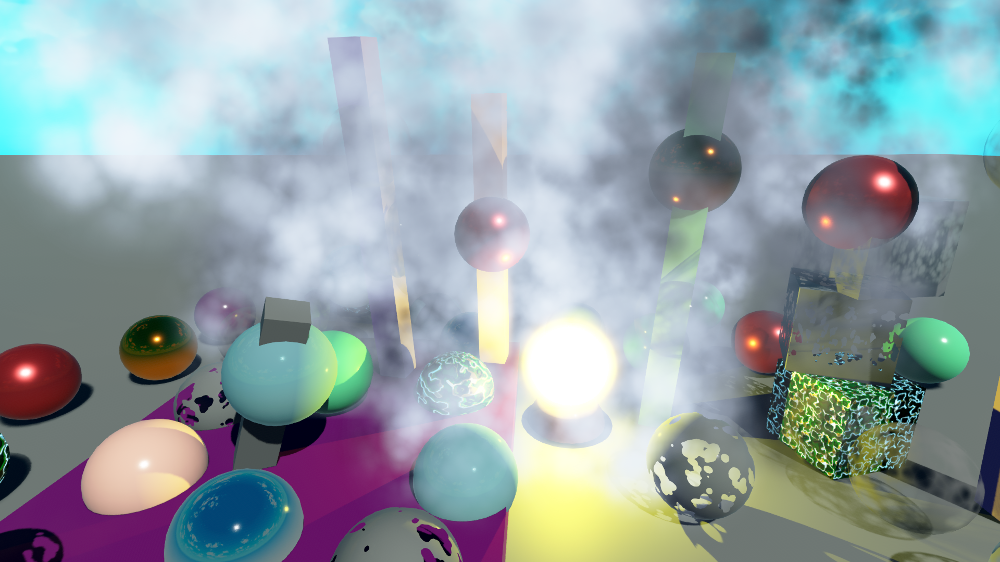 | 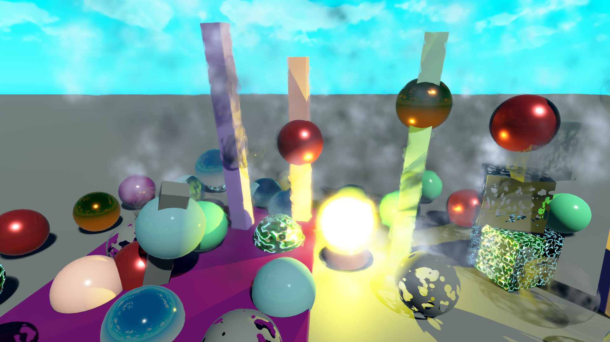 |

### Decals

It has decal shader, compatible with Forwards and Deferred paths. If used forward path, decal shader can reconstruct surface normals (and positions) from depth.  
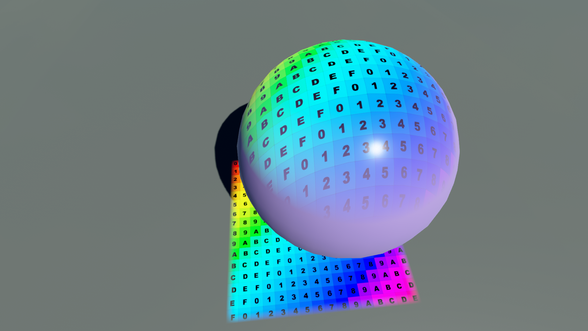  

## PostFX

### Bloom

Simulates light bleeding from bright areas. Have additive and scattering modes, and also can fade fireflies (reduces flickering from extremely bright pixels). And several more settings.  

### Color Adjustments

Fine-tune overall color balance.  

- Post Exposure: Brightness adjustment.  
- Contrast: Expand or compress tonal range.  
- Color Filter: Tints the output.  
- Hue Shift: Rotates the hue of all colors.  
- Saturation: Increases or decreases color intensity.  

### White Balance

Temperature: Warm (positive) or cool (negative) tones.  
Tint: Compensate for green/magante shifts.  

### Split Toning

Colorize shadows and highlights separately.  

### Channel Mixer

Remap RGB channels for creative color grading.  

### Shadows/Midtones/Highlights

Targeted adjustments for specific luminance ranges.  
Shadows/Midtones/Highlights: HDR color tints for each range.  
Range Controls: Define start/end points for shadows and highlights.  

### Tone Mapping

Convert HDR to LDR values. Have all URP + GranTurismo and Uncharted2 tonemapping modes.  
Modes:  

- None  
- Neutral  
- Reinhard  
- ACES  
- GranTurismo  
- Uncharted2  

### Dithering

Reduce banding artifacts in gradients.  

Also support LUT textures for postFX. So instead calculating all these transformations for each pixel individually (1920 * 1080 = 2073600 pixels), we make 32x32x32 (or 16 or 64, based on your needs) texture with all rgb values and calculate transformations only for 32768 pixels.  

| ACES Tone Mapping                                  | GT Tone Mapping                                |
| -------------------------------------------------- | ---------------------------------------------- |
| 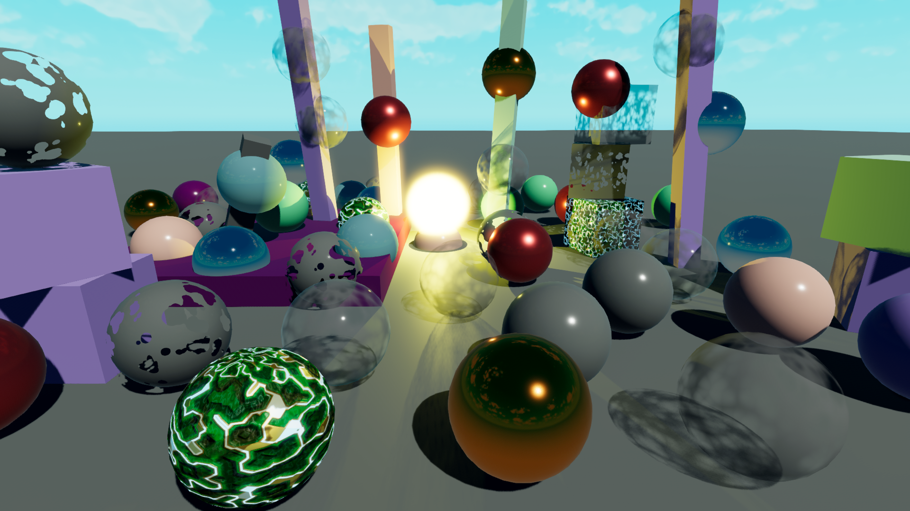 | 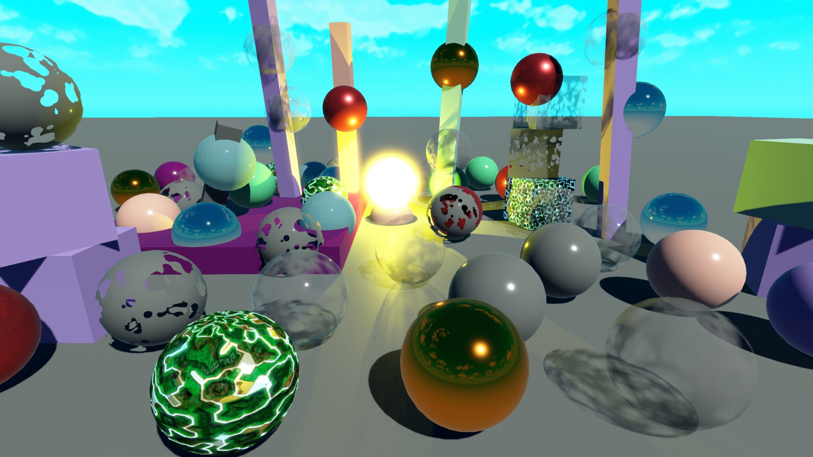 |

## Antialiasing

Noesis support:  

- SMAA2x  
- FXAA with 3 quality preset  
- DLSS with several automatic presets and manual parameters.  
- DLAA  

## Ambient Occlusion

Intel XeGTAO implementation. See https://github.com/GameTechDev/XeGTAO  
Currently supported only in Deferred path (since it main development path), but can be ported to Forward path.  

| With AO                                            | Without AO                                               |
| -------------------------------------------------- | -------------------------------------------------------- |
| 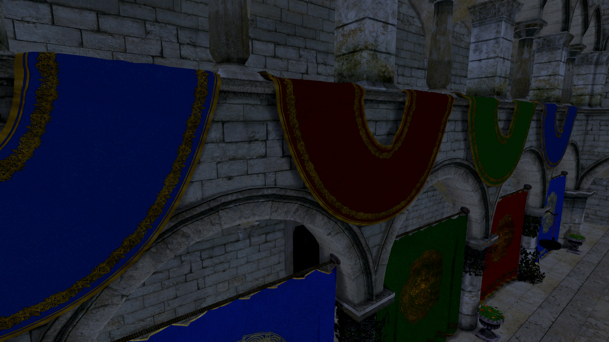 | 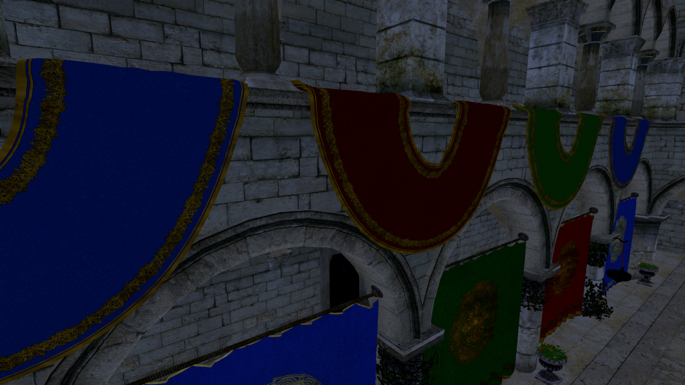 |

| With AO                                            | Without AO                                               |
| -------------------------------------------------- | -------------------------------------------------------- |
| 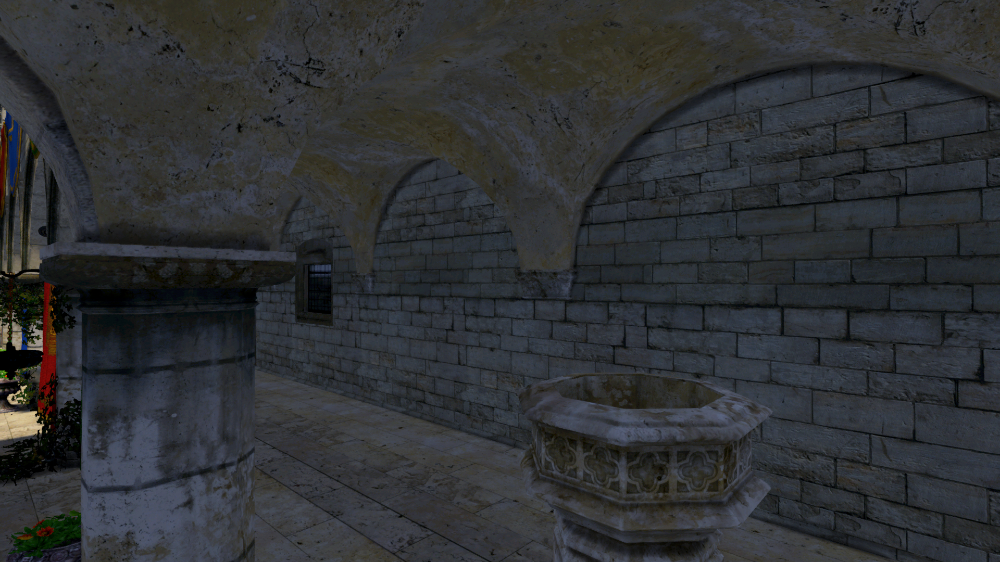 | 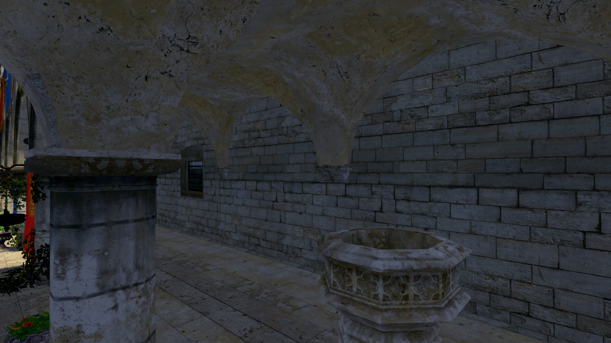 |

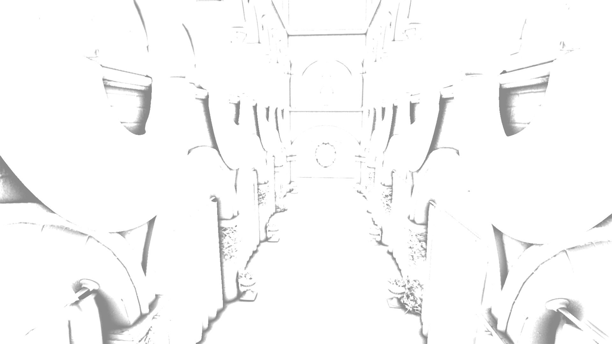 

## Portal rendering

If you dream about that your game will have portals, so you will not be restricted by euclidean space, that is what you need. Now they are fully worked in forward path, since not so many game developers dream about portals. But i can extend their support if your project needs them.  
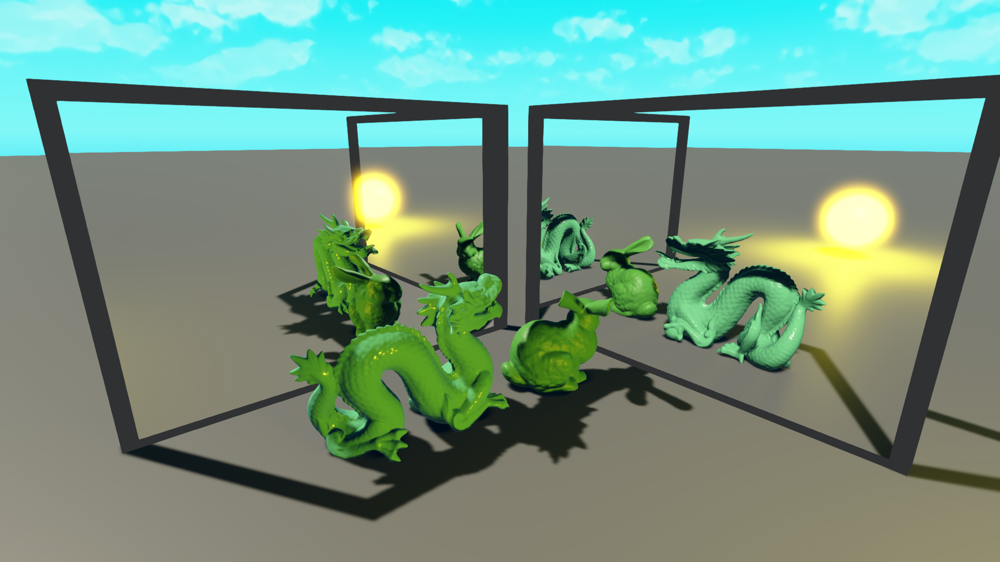  

## Known issue

If your game have split screen or any other multi camera setup with individual post effects, DLSS work incorrectly, data leak from one part of the screen to another. It possible to fix this, but require to split postFX pass into several paths. I want to keep things simple for normal games, so leave it be for now.  

## References

Unity SRP Core https://docs.unity3d.com/Packages/com.unity.render-pipelines.core@14.0/manual/index.html  
Intel XeGTAO https://github.com/GameTechDev/XeGTAO  
The Unreasonable Effectiveness of Quasirandom Sequences: Martin Roberts 2018, https://extremelearning.com.au/unreasonable-effectiveness-of-quasirandom-sequences/  
Tone Mapping, Bruno Opsenica https://bruop.github.io/tonemapping/  
Coding Adventure: Portals, Sebastian Lague https://github.com/SebLague/Portals/tree/master  
CustomSRP, cinight https://github.com/cinight/CustomSRP  
Improved normal reconstruction from depth, turanszkij https://wickedengine.net/2019/09/improved-normal-reconstruction-from-depth/  
Introduction to Decal Rendering, samdriver https://samdriver.xyz/article/decal-render-intro  
Forward vs Deferred vs Forward+ Rendering with DirectX 11, Jeremiah https://web.archive.org/web/20250310064014/https://www.3dgep.com/forward-plus/  